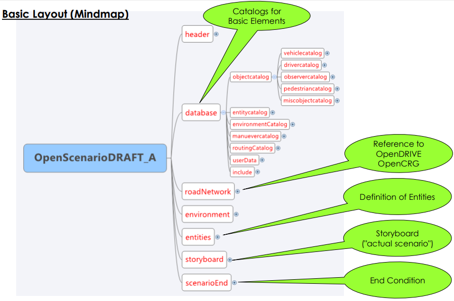

# OpenCRG
+ ASAM OpenCRG定义了一种描述路面的文件格式

+ 采集数据

+ 测量结果是带有微小误差的道路横截面数据和车辆运动朝向角，对数据进行预处理

+ 使用一种叫做"curved regular grid"(CRG)的结构存储道路中心线附近的路面高度数据，沿着道路reference line进行分割，生成网格状结构，之后把高度数据存放在规则的网格中

+ CRG数据主要内容
  1. z-array
     + z(u,v)：网格点上的高度
  2. u-axis(reference line)
     + ubeg：起点坐标(默认为0.00m)
     + uend：终点坐标
  3. v-axis(垂直于reference line)
     + vmin,vmax：中心线左/右侧的v值（等间隔或不等间隔）
  4. phi(朝向角)
     + p：reference line是直线只有一个角度值
     + p(u)：reference line上两点之间的角度
  5. r0(reference line起点)
     + (x0,y0)：UTM坐标

+ 坐标系统

+ CRG文件格式
  + 文件包含不同的模块

  + 文件必须以注释模块($CT)开始，且如果包含数据模块，则数据模块必须放在最后
  + 通常将控制文件和数据文件分开

    

  + 道路参数模块($ROAD_CRG)定义了reference line的参数和网格参数
    

  + 数据定义模块($KD_Definition)定义了哪些数据会出现在数据模块中，每一条定义以`D:`开始，reference line的坡度信息slope和朝向角phi可能会定义在这一模块
    

  + 在一些比较简单的情况下，直接通过文件读取数据同时进行数据评估，然而，有些时候希望改变评估数据的方式而不改变数据本身
    1. **Modifiers**修改存储在内存中的数据(旋转、缩放、平移等)，并应用于接下来的数据评估过程
       
    2. **Options**在不改变数据的情况下影响某些请求的执行方式
       

  + 数据模块的格式在数据定义模块($KD_Definition)中定义
    

# OpenSCENARIO

+ 动态场景不能以统一标准传输，且严重依赖于所使用工具

+ OpenSCENARIO定义了一种用于描述驾驶和交通仿真测试的**动态**场景的文件格式，且独立于软件

